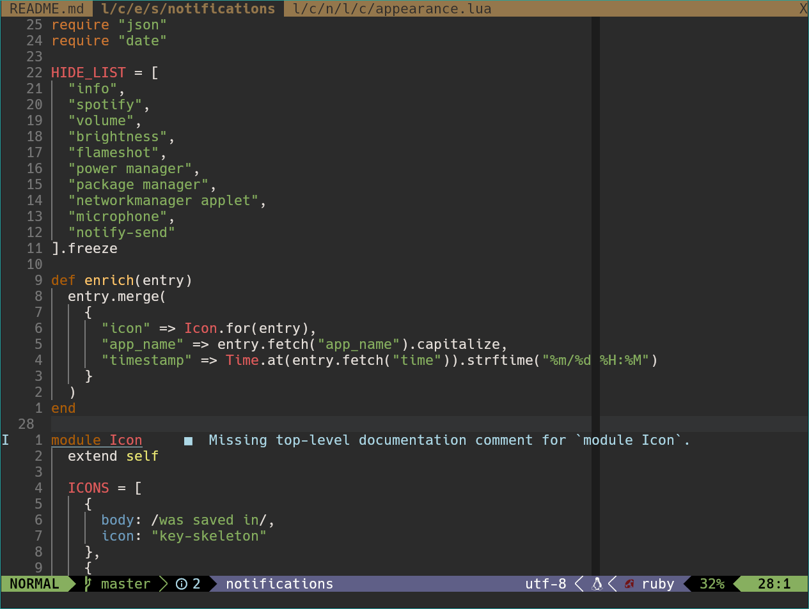
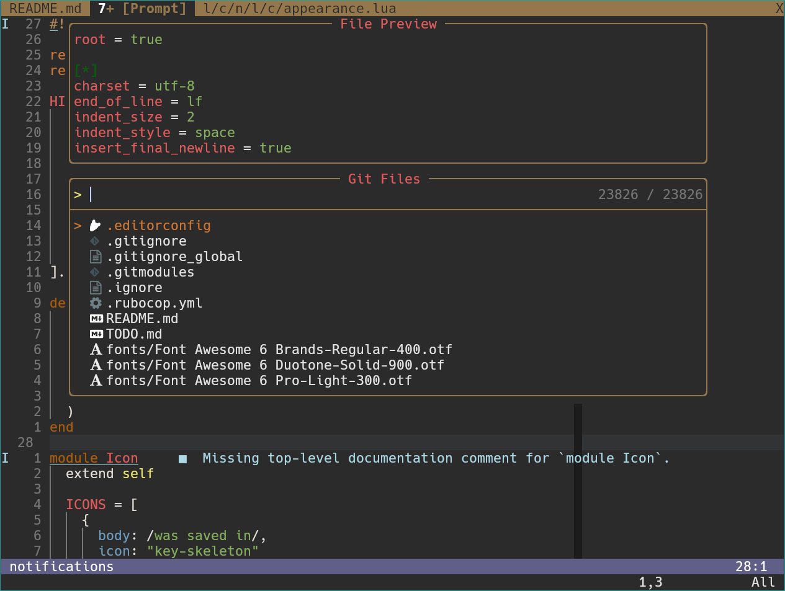

# Railscasts for Neovim

> A warm, dark Neovim colorscheme faithfully inspired by the original
> Railscasts TextMate theme.

[Installation](docs/INSTALLATION.md) · [Design language](DESIGN.md) · [Development](#development)

<p align="center">
  <a href="screenshots/ruby.png"></a>
  <a href="screenshots/telescope.png"></a>
</p>

## Railscasts, carried forward

Railscasts is a love letter to the distinctive TextMate theme used throughout
[Ryan Bates’ Railscasts](http://railscasts.com/): charcoal editor surfaces,
cream text, earthy comments, and expressive syntax color. This project brings
that language to modern Neovim while respecting the differences between
TextMate scopes, Tree-sitter captures, and LSP semantic tokens.

It is maintained as a visual port, not a reinterpretation. When a choice is
unclear, the original sources remain the reference:

- [Original TextMate theme](http://media.railscasts.com/resources/textmate_theme.zip)
- [Ryan Bates’ Vim colorscheme](https://github.com/ryanb/dotfiles/blob/997d6caa218d41cdc23e8dda3953d2fd93af2740/vim/colors/railscasts.vim)
- [Bitstream Vera Sans Mono](https://www.fontmirror.com/bitstream-vera-sans-mono),
  the font associated with the original presentation

Thank you to Ryan Bates and the Railscasts community for a visual identity that
has remained immediately recognizable for years.

## Gallery

The gallery above is designed as a side-by-side carousel for GitHub and other
Markdown renderers: select an image to view it at full size. It currently shows
Ruby editing and a Telescope picker; contributions of representative Lua, Bash,
and YAML screenshots are welcome.

## Language support

Railscasts works with every Neovim filetype. Its current visual tuning and
fixtures focus on:

- Ruby
- Lua
- Bash
- YAML

Modern Tree-sitter captures, LSP semantic tokens, diagnostics, diffs, Lualine,
ibl/IndentBlankLine, Kitty, and common Neovim UI plugins are covered by the
theme.

## Get started

Railscasts requires Neovim 0.9.5 or later.

```lua
vim.cmd.colorscheme "railscasts"
```

See the [installation guide](docs/INSTALLATION.md) for native packages,
lazy.nvim, vim-plug, Windows, Lualine, Kitty, high-contrast mode, and other
configuration details.

## Development

The repository includes a Docker runner for the same checks used in CI:

```sh
docker build --tag railscasts-ci .
docker run --rm railscasts-ci
```

To test the current working tree without rebuilding the image:

```sh
docker run --rm --volume "$PWD:/workspace" railscasts-ci
```

Future work is tracked in [TODO.md](TODO.md). Contributors should also follow
the palette and integration rules in [AGENTS.md](AGENTS.md).
